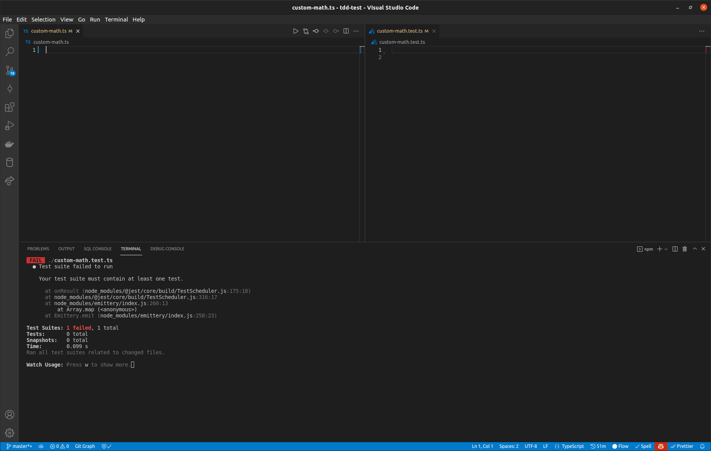
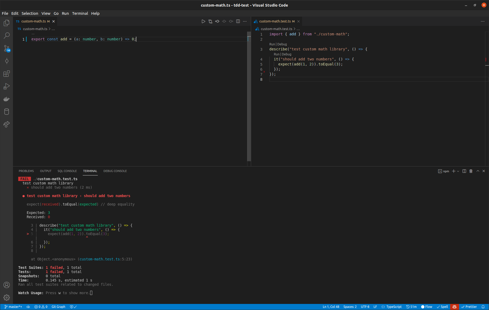
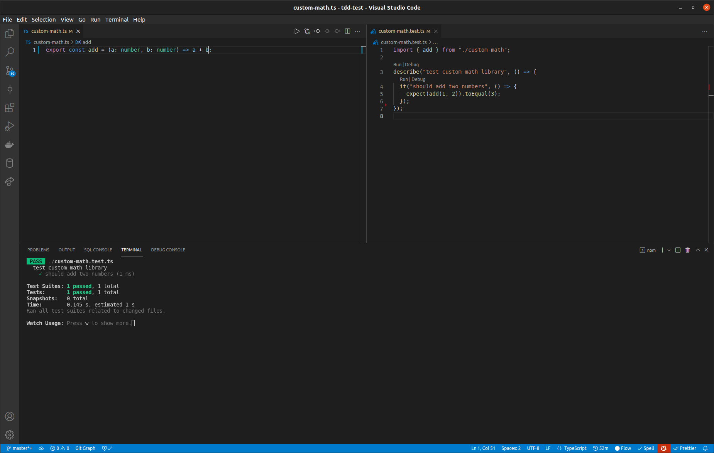
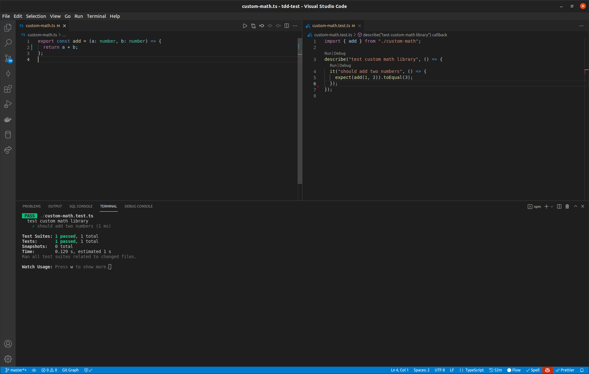
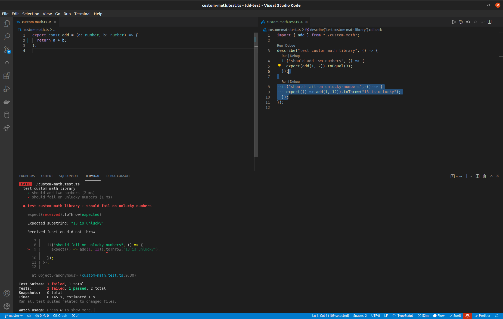
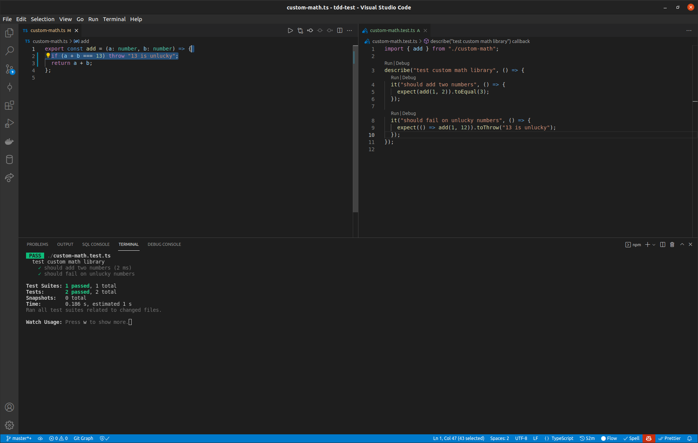
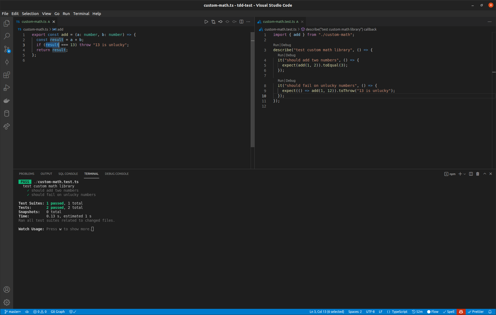

# TDD

## Disclaimer

Da ich leider nicht anwesend sein kann und auch noch nie an einem Coding Dojo teilgenommen habe, hoffe ich dass euch diese kurze Einführung ein bisschen weiter hilft.

## Schnelleinführung

1. Test schreiben der failed
2. Code schreiben der den zuvor erstellten Test grün macht
3. Code refactoren

```unknown
┌────────────┐     ┌────────────┐
│            │     │            │
│ Write Test ├────►│ Write Code │
│            │     │            │
└────────────┘     └──────┬─────┘
     ▲                    │
     │    ┌──────────┐    │
     │    │          │    │
     └────┤ Refactor │◄───┘
          │          │
          └──────────┘
```

### Regeln

- Test vor der Implementierung schreiben
- Neuen Code nur schreiben, wenn zuvor ein failender Test existiert
- Wenn der Code geändert wird, sollen alle Tests nochmal laufen
- Alle Tests sollen grün sein, bevor neue geschrieben werden

### Beispiel

Hier wird eine simple Funktion (addition) mit einem kleinen Twist nach dem TDD Verfahren programmiert.

#### 1 - Leeres Testfile und Sourcefile öffnen



#### 2 - Test schreiben (Test rot)



#### 3 - Code schreiben (Test grün)



#### 4 - Code refactoren (Test grün)



#### 5 - Test schreiben (Test rot)



#### 6 - Code schreiben (Test grün)



#### 7 - Code refactoren (Test grün)



## Testing Training

Für mehr Infos zu TDD, oder Testing im Allgemeinen, kann auf das Training zurückgegriffen werden (<https://github.com/Gepardec/testing-training/blob/master/2-entry-to-tdd/README.md>)
